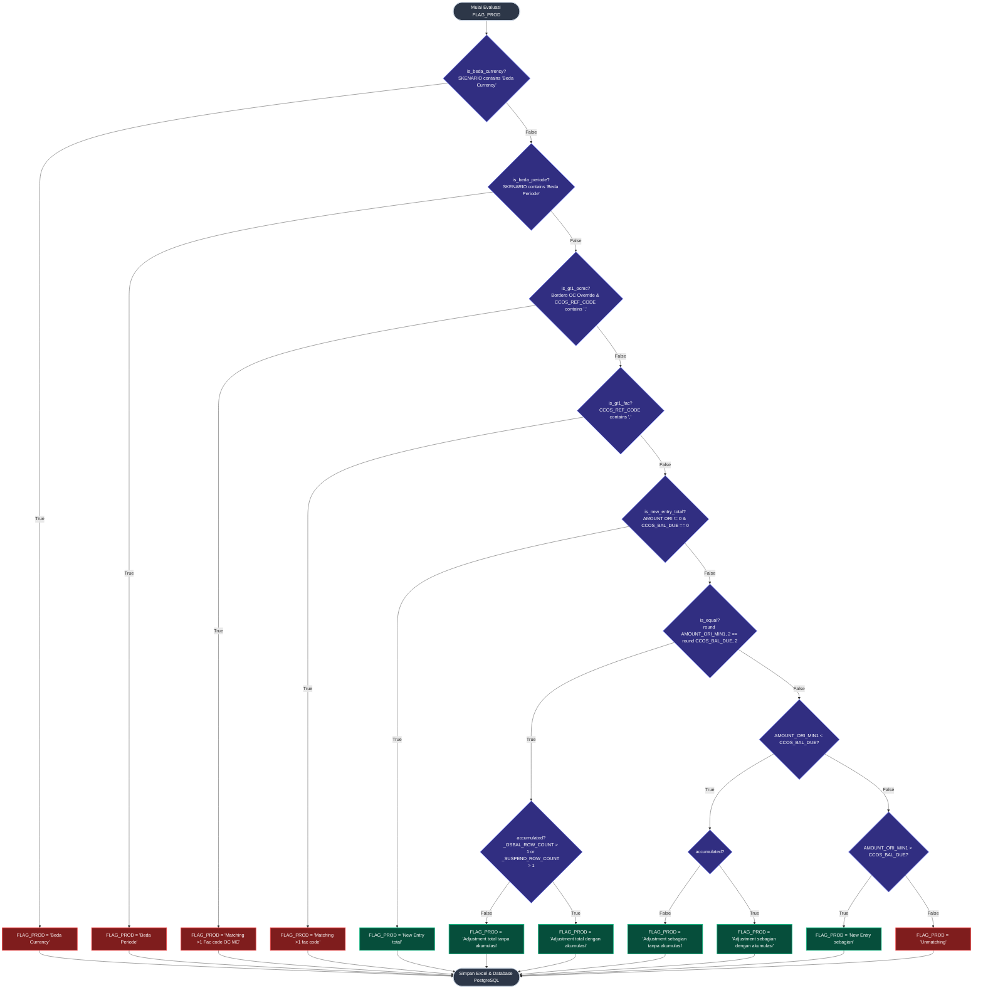

# Dokumen Teknis: Arsitektur & Logika Eksekusi Matching Suspend ACA (`prod_sus_1_new.py`)

Dokumen ini berisi spesifikasi teknis mendalam dan alur algoritma komprehensif dari script produksi **`prod_sus_1_new.py`**. Seluruh tahapan, terminologi, nama variabel, struktur data indeks, dan logika pengambilan keputusan dijelaskan secara presisi sesuai implementasi kode sumber.

---

## 1. Arsitektur Data & Pembangunan Indeks Inverted (`_build_lookup`)

Sebelum iterasi baris data suspend dijalankan, sistem membaca file sumber Excel/Pickle cache, melakukan pra-parsing tanggal, mendeteksi kolom bersih (*clean columns*), dan membangun struktur data memori (indeks terbalik / *inverted index*) untuk memfasilitasi pencarian $O(1)$ dan operasi irisan set.

### 1.1 Variabel Konfigurasi & Sumber Data
- **File Sumber:**
  - `SUSPEND_FILE`: `data/suspend_clean_aca.xlsx`
  - `OSBAL_FILE`: `data/osbal_clean_aca.xlsx`
  - `FACUL_FILE`: `data/facul_clean_aca.xlsx`
  - `SLIPDB_FILE`: ditentukan via `_find_slipdb_file()` (`data/slipdb_clean_aca.xlsx`, `data/ri slip.xlsx`, dll.)
  - `BORDERO_FILE`: ditentukan via `_find_bordero_file()` (`data/ACA_Open_Cover_Marine_Cargo.xlsx`, dll.)
  - `OUTPUT_FILE`: `data/final_output_v1.xlsx`
- **Kolom Kunci Finansial & Referensi:**
  - `OSBAL_FACODE_COL = "CCOS_REF_CODE"`
  - `FACUL_FACODE_COL = "FAC_CODE"`
  - `SLIPDB_FACODE_COL = "FAC_CODE"` / `"FAC CODE"` / `"CCOS_REF_CODE"`
  - `SUSPEND_CURR_COL = "CURR ORI"`, `OSBAL_CURR_COL = "CCOS_CURR"`
  - `SUSPEND_DATE_COL = "RECEIPT DATE"`, `OSBAL_DATE_COL = "FAC_COM_DATE"`
  - `_EXCLUDED_REF_MARKERS = ["HUTANG PIUTANG", "DATA SUSPENSE"]`
  - `_LINESLIP_MARKERS = ("LINESLIP", "LINE SLIP")`

### 1.2 Pra-Parsing & Deteksi Kolom Efektif
1. **Parsing Tanggal:**
   - Baris OSBAL: `r["_com_date_parsed"] = pd.to_datetime(r["FAC_COM_DATE"])`
   - Baris Suspend: `r["_sus_date_parsed"] = pd.to_datetime(r["RECEIPT DATE"])`
2. **Evaluasi Aturan LINESLIP (`_is_lineslip_row`):**
   - Jika kolom `clean insured` atau `insured_ori` memuat marker `_LINESLIP_MARKERS`:
     - `r["_is_lineslip"] = True`
     - Tanggal efektif mundur 1 bulan: `r["_sus_date_lineslip"] = _sus_date_parsed - pd.DateOffset(months=1)`
3. **Deteksi Kolom Efektif Baris Suspend (`_get_effective_sus_cols`):**
   - Jika `CLSDT_POLICY_NO` terisi $\rightarrow$ `eff_polis = ["CLSDT_POLICY_NO"]`, jika kosong $\rightarrow$ fallback ke `polis_sus` (`clean polis 1`, `clean polis 2`, dst.).
   - Jika `CLSDT_SLIP_NO` terisi $\rightarrow$ `eff_slip = ["CLSDT_SLIP_NO"]`, jika kosong $\rightarrow$ fallback ke `slip_sus` (`clean slip 1`, `clean slip 2`, dst.).
   - `like_polis` dan `like_slip` menambahkan kolom `FAC_POLICY_NO` / `FAC_SLIP` sebagai kandidat wildcard.
4. **Struktur Lookup Index Tuple (10 Elemen):**
   Fungsi `_build_lookup()` memfilter baris administratif (`_is_excluded_ref_row`) lalu mengembalikan tuple:
   - `[0]`: `lkp_slip_cln` $\rightarrow$ Inverted index exact slip (`dict[str, list[int]]`)
   - `[1]`: `lkp_polis_cln` $\rightarrow$ Inverted index exact polis (`dict[str, list[int]]`)
   - `[2]`: `lkp_ins_cln` $\rightarrow$ Inverted index exact insured (`dict[str, list[int]]`)
   - `[6]`: `tok_slip` $\rightarrow$ `(token_index, token_cache)` untuk LIKE slip
   - `[7]`: `tok_polis` $\rightarrow$ `(token_index, token_cache)` untuk LIKE polis
   - `[8]`: `tok_ins` $\rightarrow$ `(token_index, token_cache)` untuk LIKE insured
   - `[9]`: `facode_index` $\rightarrow$ Pemetaan `FAC_CODE` ke baris OSBAL (`dict[str, list[int]]`)

```mermaid
flowchart TD
    classDef startEnd fill:#2d3748,stroke:#cbd5e1,stroke-width:2px,color:#fff;
    classDef process fill:#1e293b,stroke:#3b82f6,stroke-width:2px,color:#fff;
    classDef decision fill:#312e81,stroke:#818cf8,stroke-width:2px,color:#fff;
    classDef storage fill:#1f2937,stroke:#10b981,stroke-width:2px,color:#fff;

    Start([Mulai Inisialisasi]):::startEnd --> LoadFiles[Load Excel/Pickle: suspend_rows, osbal_rows, facul_rows, slipdb_rows, bordero_rows]:::storage
    
    LoadFiles --> ParseDates[Pre-parsing Tanggal:<br>osbal['_com_date_parsed'] = pd.to_datetime FAC_COM_DATE<br>sus['_sus_date_parsed'] = pd.to_datetime RECEIPT DATE]:::process
    
    ParseDates --> CheckLineslip{_is_lineslip_row sus?<br>Cek marker LINESLIP di insured}:::decision
    CheckLineslip -- True --> SetLSDate[sus['_is_lineslip'] = True<br>sus['_sus_date_lineslip'] = sus_date - DateOffset months=1]:::process
    CheckLineslip -- False --> SetNormDate[sus['_is_lineslip'] = False<br>sus['_sus_date_lineslip'] = None]:::process
    
    SetLSDate --> DetectCols
    SetNormDate --> DetectCols

    DetectCols[Deteksi Kolom Bersih via _get_clean_cols:<br>polis_sus, slip_sus, insured_sus, sertif_sus<br>Prepend CLSDT_POLICY_NO & CLSDT_SLIP_NO]:::process --> BuildLookups
    
    BuildLookups[Bangun Inverted Indexes via _build_lookup:<br>1. lookup_osbal tuple 0..9<br>2. lookup_facul tuple 0..9<br>3. lookup_slipdb tuple 0..9<br>4. sertif_osbal_idx via _build_sertif_index<br>5. bordero_idx & bordero_polis_index]:::process --> Ready([Indeks Siap untuk Matching Loop]):::startEnd
```

---

## 2. Alur Eksekusi Mesin Matching 6-Fase (`run()`)

Untuk setiap baris `sus` dalam `suspend_rows`, jika `sus["STATUS"] == "MATCHING"` maka dilewati (*skip*). Jika tidak, sistem mengeksekusi pipeline 6 fase berikut:

### 2.1 Rincian Logika per Fase

#### FASE 1: Pencarian Awal Berdasarkan Polis
1. Ambil nilai polis unik: `polis_vals = _collect_clean_values(sus, eff_polis)`.
2. Jika `polis_vals` tidak kosong:
   - **OSBAL Check:** `osb_hits = _exact_match(polis_vals, lookup_osbal[1])`. Jika ada, `matched_osbal_idx.update(osb_hits)`, set `found_by_polis = True`.
   - **SLIPDB Cross-Check:** `sld_hits = _exact_match(polis_vals, lookup_slipdb[1])`. Jika ada, konversi via `_resolve_facode(..., SLIPDB_FACODE_COL, facode_osbal_idx, osbal_rows)` $\rightarrow$ update `matched_osbal_idx`, set `found_by_polis = True`.
   - **FACUL Cross-Check:** `fac_hits = _exact_match(polis_vals, lookup_facul[1])`. Jika ada, konversi via `_resolve_facode(..., FACUL_FACODE_COL, facode_osbal_idx, osbal_rows)` $\rightarrow$ update `matched_osbal_idx`, set `found_by_polis = True`.
3. Jika `found_by_polis == True`:
   - Set `source = "OSBAL"` dan `scenario = "Polis only"`.

#### FASE 2: Pencarian Awal Berdasarkan Slip (Fallback jika `not found_by_polis`)
1. Ambil nilai slip unik: `slip_vals = _collect_clean_values(sus, slip_sus)`.
2. Jika `slip_vals` tidak kosong:
   - **OSBAL Check:** `osb_hits = _exact_match(slip_vals, lookup_osbal[0])`. Jika hit $\rightarrow$ `source = "OSBAL"`, `scenario = "Slip only"`.
   - **SLIPDB Check:** Jika tidak hit di OSBAL, `sld_hits = _exact_match(slip_vals, lookup_slipdb[0])` $\rightarrow$ `_resolve_facode` $\rightarrow$ jika hit $\rightarrow$ `source = "SLIPDB"`, `scenario = "Slip only"`.
   - **FACUL Check:** Jika belum ada match di `matched_osbal_idx`, `fac_hits = _exact_match(slip_vals, lookup_facul[0])` $\rightarrow$ `_resolve_facode` $\rightarrow$ jika hit $\rightarrow$ `source = "FACUL"`, `scenario = "Slip only"`.

#### FASE 3: Pencarian Awal Berdasarkan Insured (Fallback jika `not matched_osbal_idx`)
1. Ambil nilai insured unik: `ins_vals = _collect_clean_values(sus, insured_sus)`.
2. Jika `ins_vals` tidak kosong, pencarian dilakukan secara berurutan dan berhenti pada kecocokan pertama (*cascading / mutually exclusive*):
   - **OSBAL Check:** `osb_hits = _exact_match(ins_vals, lookup_osbal[2])`. Jika hit $\rightarrow$ `source = "OSBAL"`, `scenario = "Insured only"`.
   - **SLIPDB Check:** Jika tidak ada hit OSBAL, `sld_hits = _exact_match(ins_vals, lookup_slipdb[2])` $\rightarrow$ `_resolve_facode` $\rightarrow$ `source = "SLIPDB"`, `scenario = "Insured only"`.
   - **FACUL Check:** Jika tidak ada hit SLIPDB, `fac_hits = _exact_match(ins_vals, lookup_facul[2])` $\rightarrow$ `_resolve_facode` $\rightarrow$ `source = "FACUL"`, `scenario = "Insured only"`.

#### FASE 4: Narrowing Wajib (Currency & Periode) + Strict Rematch Fallback
Jika `matched_osbal_idx` memiliki kandidat baris:
1. **Validasi Mata Uang (`sus_curr` vs `OSBAL_CURR_COL`):**
   - `filtered_curr = [i for i in matched_list if _normalize(osbal_rows[i]["CCOS_CURR"]) == sus_curr]`
   - Jika `filtered_curr` kosong $\rightarrow$ tandai `is_beda_curr = True`.
   - Jika `len(filtered_curr) < len(matched_list)` $\rightarrow$ perbarui `matched_list = filtered_curr`.
2. **Validasi Periode Transaksi (`effective_date` vs `_com_date_parsed`):**
   - Hanya dievaluasi jika `not is_beda_curr` dan `pd.notna(effective_date)`.
   - Untuk setiap `i in matched_list`, ambil `com_date = osbal_rows[i]["_com_date_parsed"]`:
     - Jika `_is_ls == True` (LINESLIP): harus exact bulan dan tahun (`com_date.year == sus_date.year and com_date.month == sus_date.month`).
     - Jika bukan LINESLIP: tanggal bayar tidak boleh mendahului inception (`sus_date >= com_date`).
   - Jika `filtered_per` kosong $\rightarrow$ tandai `is_beda_per = True`.
   - Jika `len(filtered_per) < len(matched_list)` $\rightarrow$ perbarui `matched_list = filtered_per`.
3. **Pencarian Ulang Ketat (`_rematch_strict`):**
   - Jika terjadi `is_beda_curr == True` atau `is_beda_per == True`, sistem **tidak langsung menyerah**. Fungsi `_rematch_strict` memindai ulang seluruh basis data dengan filter ketat `_strict_filter` (hanya baris yang memenuhi `CCOS_CURR == sus_curr` dan validitas periode):
     - **R1:** `lookup_osbal[1]` (Polis exact) $\rightarrow$ jika ada konfirmasi slip jadikan `"Polis + Slip"`, else `"Polis only"`.
     - **R2:** `lookup_osbal[7][0]` (Polis LIKE token match).
     - **R3:** `lookup_slipdb[1]` (Polis exact) $\rightarrow$ `_resolve_facode`.
     - **R4:** `lookup_facul[1]` (Polis exact) $\rightarrow$ `_resolve_facode`.
     - **R5:** `lookup_osbal[2]` (Insured exact).
   - Jika `_rematch_strict` menemukan hasil: `source`, `scenario`, dan `matched_list` digantikan dengan hasil rematch, serta flag `is_beda_curr = False` dan `is_beda_per = False` direset.
4. Perbarui `matched_osbal_idx = set(matched_list)`.

#### FASE 5: Narrowing Utama Bertingkat Non-Destruktif
Jika `len(matched_osbal_idx) > 1`, sistem mengerucutkan kandidat tanpa menghilangkan seluruh baris jika kondisi parsial tidak terpenuhi:
1. **Konfirmasi Slip Exact:** Cek apakah `slip_vals` ada pada `osbal_rows[idx]` via `_ref_has_value`. Jika ada subset yang cocok, pertahankan subset tersebut dan ubah `scenario = "Polis + Slip"`.
2. **Konfirmasi Slip Range Numerik (Step 1b):** Jika slip exact tidak mempersempit hasil dan masih multikandidat, cek apakah nomor slip numerik jatuh di antara batas `clean slip 1` dan `clean slip 2` milik OSBAL via `_slip_in_range`. Jika subset cocok, pertahankan subset tersebut dan ubah skenario `"Polis + Slip"`.
3. **Konfirmasi Sertifikat:** Ambil sertifikat dari `sertif_sus` dan ekstrak 6 digit dari string polis via `_extract_cert_from_polis()`. Jika cocok pada `sertif_osbal` (termasuk deteksi range mis. `100 s/d 110`), persempit `matched_list` dan tambahkan suffix `scenario += " + Cert"`.
4. **Konfirmasi Insured:** Cocokkan nilai `insured_sus` / `insured_ori` via `_ref_has_value`. Jika cocok, persempit `matched_list` dan tambahkan suffix `scenario += " + Insured"`.
5. Perbarui `matched_osbal_idx = set(matched_list)`.

#### FASE 6: Bordero Open Cover Override (`_find_fac_codes_in_bordero`)
Jika `bordero_idx` tersedia dan (`found_by_polis == True` atau `matched_osbal_idx` terisi):
1. Evaluasi query polis pada `bordero_polis_index`. Pencarian ini menggunakan mekanisme 2-tahap optimasi:
   - **Exact Match:** Mencari polis base secara *O(1)* pada keys `bordero_polis_index` (sangat cepat).
   - **Like Match (Substring):** Jika exact match kosong, lakukan cross-check substring panjang minimal 5 karakter antar kandidat polis (`sp in bp` atau `bp in sp`).
2. Terapkan filter berjenjang internal Bordero pada hasil kandidat polis:
   - Filter kesesuaian sertifikat (`mc(r)`: `r["cert"] in sus_cert`).
   - Filter kesesuaian slip (`ms(r)`: `r["slip"] in sus_slip`).
   - Filter wajib Currency & Periode (`mcurr(r)` dan `mper(r)`: `r["period"] <= sus_ym`).
   - Filter kesesuaian nilai net (`mnet(r)`: $||\text{net}| - |\text{AMOUNT ORI}|| < 0.05$).
3. Jika Bordero menghasilkan `bordero_facs`:
   - Konversi seluruh fac code ke indeks baris OSBAL via `facode_osbal_idx`.
   - Override indeks kandidat: `matched_osbal_idx = set(res_idx)`.
   - Update label skenario: `scenario = f"{scenario} -> Bordero OC Override"` (atau `"Bordero OC Override"`).
   - Set `resolved = True`.

#### Post-Matching & Normalisasi Label
- Jika `is_beda_curr == True` $\rightarrow$ `scenario = "Beda Currency"`, `osbal_count = 0`.
- Jika `is_beda_per == True` $\rightarrow$ `scenario = "Beda Periode"`, `osbal_count = 0`.
- Jika `not matched_osbal_idx` $\rightarrow$ `source = None`, `scenario = "Unmatching"`.
- Normalisasi teks: `scenario = scenario.replace(" only + ", " + ")` (menjamin tidak ada penamaan rancu seperti `"Polis only + Insured"`).

---

### Flowchart 2: Detail Mesin Matching 6-Fase
```mermaid
flowchart TD
    classDef startEnd fill:#2d3748,stroke:#cbd5e1,stroke-width:2px,color:#fff;
    classDef process fill:#1e293b,stroke:#3b82f6,stroke-width:2px,color:#fff;
    classDef decision fill:#312e81,stroke:#818cf8,stroke-width:2px,color:#fff;
    classDef subfill fill:#064e3b,stroke:#10b981,stroke-width:2px,color:#fff;
    classDef warnfill fill:#78350f,stroke:#f59e0b,stroke-width:2px,color:#fff;

    StartRow([Mulai Baris Suspend]):::startEnd --> CheckStatus{sus['STATUS'] == 'MATCHING'?}:::decision
    CheckStatus -- Ya --> SkipRow([Abaikan Baris]):::startEnd
    CheckStatus -- Tidak --> InitVars[Inisialisasi:<br>eff_polis, eff_slip via _get_effective_sus_cols<br>effective_date = _sus_date_lineslip or _sus_date_parsed<br>matched_osbal_idx = set(), source = None, scenario = '']:::process

    InitVars --> Fase1Polis
    
    subgraph S_FASE1 ["FASE 1: Pencarian Berdasarkan Polis"]
        Fase1Polis{polis_vals ada?}:::decision
        Fase1Polis -- Ya --> MatchOsbPolis{_exact_match polis_vals di lookup_osbal[1]?}:::decision
        MatchOsbPolis -- Hit --> SetPolisOsb[matched_osbal_idx.update osb_hits<br>found_by_polis = True]:::process
        MatchOsbPolis -- Miss / Lanjut --> MatchSldPolis{_exact_match di lookup_slipdb[1]?}:::decision
        MatchSldPolis -- Hit --> ResolveSld[res_idx = _resolve_facode SLIPDB<br>matched_osbal_idx.update res_idx<br>found_by_polis = True]:::process
        MatchSldPolis -- Miss / Lanjut --> MatchFacPolis{_exact_match di lookup_facul[1]?}:::decision
        MatchFacPolis -- Hit --> ResolveFac[res_idx = _resolve_facode FACUL<br>matched_osbal_idx.update res_idx<br>found_by_polis = True]:::process
        MatchFacPolis -- Miss --> EndFase1{found_by_polis == True?}:::decision
        SetPolisOsb --> EndFase1
        ResolveSld --> EndFase1
        ResolveFac --> EndFase1
        EndFase1 -- Ya --> SetLabelP1[source = 'OSBAL'<br>scenario = 'Polis only']:::process
    end

    Fase1Polis -- Tidak --> Fase2Slip
    EndFase1 -- Tidak --> Fase2Slip
    SetLabelP1 --> Fase4NarrowWajib

    subgraph S_FASE2 ["FASE 2: Pencarian Berdasarkan Slip (Fallback)"]
        Fase2Slip{slip_vals ada?}:::decision
        Fase2Slip -- Ya --> MatchOsbSlip{_exact_match di lookup_osbal[0]?}:::decision
        MatchOsbSlip -- Hit --> SetSlipOsb[matched_osbal_idx.update osb_hits<br>source = 'OSBAL', scenario = 'Slip only']:::process
        MatchOsbSlip -- Miss --> MatchSldSlip{_exact_match di lookup_slipdb[0]?}:::decision
        MatchSldSlip -- Hit --> ResolveSldSlip[res_idx = _resolve_facode SLIPDB<br>matched_osbal_idx.update res_idx<br>source = 'SLIPDB', scenario = 'Slip only']:::process
        MatchSldSlip -- Miss --> MatchFacSlip{_exact_match di lookup_facul[0]?}:::decision
        MatchFacSlip -- Hit --> ResolveFacSlip[res_idx = _resolve_facode FACUL<br>matched_osbal_idx.update res_idx<br>source = 'FACUL', scenario = 'Slip only']:::process
    end

    Fase2Slip -- Tidak --> Fase3Insured
    MatchFacSlip -- Miss --> Fase3Insured
    SetSlipOsb --> Fase4NarrowWajib
    ResolveSldSlip --> Fase4NarrowWajib
    ResolveFacSlip --> Fase4NarrowWajib

    subgraph S_FASE3 ["FASE 3: Pencarian Berdasarkan Insured (Fallback)"]
        Fase3Insured{matched_osbal_idx kosong & ins_vals ada?}:::decision
        Fase3Insured -- Ya --> MatchOsbIns{_exact_match di lookup_osbal[2]?}:::decision
        MatchOsbIns -- Hit --> SetInsOsb[source = 'OSBAL', scenario = 'Insured only']:::process
        MatchOsbIns -- Miss --> MatchSldIns{_exact_match di lookup_slipdb[2]?}:::decision
        MatchSldIns -- Hit --> ResolveSldIns[res_idx = _resolve_facode SLIPDB<br>source = 'SLIPDB', scenario = 'Insured only']:::process
        MatchSldIns -- Miss --> MatchFacIns{_exact_match di lookup_facul[2]?}:::decision
        MatchFacIns -- Hit --> ResolveFacIns[res_idx = _resolve_facode FACUL<br>source = 'FACUL', scenario = 'Insured only']:::process
    end

    Fase3Insured -- Tidak --> Fase4NarrowWajib
    MatchFacIns -- Miss --> Fase4NarrowWajib
    SetInsOsb --> Fase4NarrowWajib
    ResolveSldIns --> Fase4NarrowWajib
    ResolveFacIns --> Fase4NarrowWajib

    subgraph S_FASE4 ["FASE 4: Narrowing Wajib (Curr & Periode) + Strict Rematch"]
        Fase4NarrowWajib{matched_osbal_idx tidak kosong?}:::decision
        Fase4NarrowWajib -- Ya --> FilterCurr[Filter CCOS_CURR == sus_curr]:::process
        FilterCurr --> CheckCurrHit{filtered_curr ada?}:::decision
        CheckCurrHit -- Tidak --> MarkBedaCurr[is_beda_curr = True]:::warnfill
        CheckCurrHit -- Ya --> ApplyCurr[matched_list = filtered_curr]:::process --> FilterPer
        
        FilterPer{effective_date notna?}:::decision
        FilterPer -- Ya --> CheckPerCond[_is_ls ? year & month sama : sus_date >= com_date]:::process
        CheckPerCond --> CheckPerHit{filtered_per ada?}:::decision
        CheckPerHit -- Tidak --> MarkBedaPer[is_beda_per = True]:::warnfill
        CheckPerHit -- Ya --> ApplyPer[matched_list = filtered_per]:::process --> CheckTriggerRematch
        FilterPer -- Tidak --> CheckTriggerRematch

        MarkBedaCurr --> CheckTriggerRematch
        MarkBedaPer --> CheckTriggerRematch
        
        CheckTriggerRematch{is_beda_curr or is_beda_per?}:::decision
        CheckTriggerRematch -- Ya --> RunRematch[Panggil _rematch_strict:<br>R1: OSBAL polis exact + slip confirm<br>R2: OSBAL polis LIKE<br>R3: SLIPDB polis exact<br>R4: FACUL polis exact<br>R5: OSBAL insured exact]:::process
        RunRematch --> RematchSuccess{Rematch Berhasil?}:::decision
        RematchSuccess -- Ya --> AdoptRematch[matched_list = hits<br>source = src, scenario = scen<br>is_beda_curr = False, is_beda_per = False]:::subfill --> UpdateMIdx[matched_osbal_idx = set matched_list]:::process
        RematchSuccess -- Tidak --> UpdateMIdx
        CheckTriggerRematch -- Tidak --> UpdateMIdx
    end

    Fase4NarrowWajib -- Tidak --> Fase6Bordero
    UpdateMIdx --> Fase5NarrowUtama

    subgraph S_FASE5 ["FASE 5: Narrowing Non-Destruktif (len > 1)"]
        Fase5NarrowUtama{len matched_osbal_idx > 1?}:::decision
        Fase5NarrowUtama -- Ya --> StepSlip{Cek slip_vals di slip_osbal via _ref_has_value}:::process
        StepSlip -- Hit --> ApplySlipNarrow[matched_list = confirmed<br>scenario = 'Polis + Slip']:::process --> StepSlipRange
        StepSlip -- Miss --> StepSlipRange{Cek range slip via _slip_in_range}:::process
        
        StepSlipRange -- Hit --> ApplySlipRangeNarrow[matched_list = confirmed_slip<br>scenario = 'Polis + Slip']:::process --> StepCert
        StepSlipRange -- Miss --> StepCert
        
        StepCert{Cek sus_cert_vals di sertif_osbal}:::process
        StepCert -- Hit --> ApplyCertNarrow[matched_list = confirmed<br>scenario += ' + Cert']:::process --> StepIns
        StepCert -- Miss --> StepIns
        
        StepIns{Cek ins_vals di insured_osbal}:::process
        StepIns -- Hit --> ApplyInsNarrow[matched_list = confirmed<br>scenario += ' + Insured']:::process --> EndFase5
        StepIns -- Miss --> EndFase5
        EndFase5[matched_osbal_idx = set matched_list]:::process
    end

    Fase5NarrowUtama -- Tidak --> Fase6Bordero
    EndFase5 --> Fase6Bordero

    subgraph S_FASE6 ["FASE 6: Bordero Open Cover Override"]
        Fase6Bordero{bordero_idx ada & found_by_polis or matched_osbal_idx?}:::decision
        Fase6Bordero -- Ya --> CallBordero[Panggil _find_fac_codes_in_bordero:<br>1. Exact/Like match bordero_polis_index<br>2. Filter cert, slip, wajib curr/period, net match]:::process
        CallBordero --> BorderoHit{Bordero matched?}:::decision
        BorderoHit -- Ya --> ApplyBordero[res_idx = facode_osbal_idx bordero_facs<br>matched_osbal_idx = set res_idx<br>scenario += ' -> Bordero OC Override'<br>resolved = True]:::subfill
        BorderoHit -- Tidak --> FinalizeLabels
    end

    Fase6Bordero -- Tidak --> FinalizeLabels
    ApplyBordero --> FinalizeLabels

    FinalizeLabels[Post-Processing Labels:<br>1. Jika is_beda_curr -> scenario = 'Beda Currency'<br>2. Jika is_beda_per -> scenario = 'Beda Periode'<br>3. Bersihkan: scenario.replace ' only + ' with ' + '<br>4. Ekstrak fac_codes unik dari OSBAL]:::process --> AppendRaw[raw_results.append sus, source, scenario, matched_osbal_idx, fac_codes]:::process --> EndRow([Selesai Baris]):::startEnd
```

---

## 3. Klaim Fac Code, Agregasi Finansial & Akumulasi Suspend

Setelah matching per-baris selesai, sistem melakukan optimasi alokasi pada baris-baris multi-fac code dan menggabungkan suspend yang merujuk pada `FAC_CODE` yang sama.

### 3.1 Logika Klaim Fac Code Tunggal (`claimed`)
1. Baris yang memiliki tepat 1 `FAC_CODE` (dan bukan skenario penolakan `"Unmatching"`, `"Beda Currency"`, `"Beda Periode"`) otomatis mengklaim kode tersebut: `claimed |= r["fac_codes"]`.
2. Untuk baris dengan $>1$ kandidat `FAC_CODE`, sistem mengeliminasi kode yang sudah diklaim baris lain:
   $$\text{remaining} = r[\text{"fac_codes"}] - \text{claimed}$$
   Jika tersisa tepat 1 kode, maka kandidat dipersempit menjadi kode tersebut, dan indeks OSBAL disaring ulang (`r["osbal_idx"] = [i for i in r["osbal_idx"] if osbal_rows[i]["CCOS_REF_CODE"] == fac]`).

### 3.2 Akumulasi Multi-Suspend per Fac Code (`_merge_suspend_rows`)
- Baris suspend yang memiliki `FAC_CODE` tunggal dan sama dikelompokkan ke dalam `groups[fac]`.
- Jika `len(group) > 1` (akumulasi cicilan/multi-payment):
  - Jumlahkan nilai uang: `_merged_amount_ori = sum(AMOUNT ORI)`.
  - Gabungkan teks unik pada kolom `_SUSPEND_JOIN_COLS` (`RECEIPT NO`, `CREDIT NOTES`, `DESC 1..4`, dll.) dengan pemisah koma.
  - Set `_SUSPEND_ROW_COUNT = len(group)`.
  - Seluruh baris transaksi asli tetap dicetak ke file output (tidak di-drop).

### 3.3 Agregasi Finansial OSBAL (`_aggregate_ccos`)
- Jika kandidat merujuk pada $>1$ `FAC_CODE` yang ambigu (`multi_fac == True`), atau status merupakan `"Beda Currency"` / `"Beda Periode"`:
  - `CCOS_OR_BAL = np.nan`
  - `CCOS_BAL_DUE = np.nan`
- Jika merujuk pada `FAC_CODE` tunggal:
  - `CCOS_REF_CODE`: join nilai unik `CCOS_REF_CODE`.
  - `CCOS_OR_BAL`: join nilai unik `CCOS_OR_BAL`.
  - `CCOS_BAL_DUE`: akumulasi sum dari `bal_due_rows` (mencakup seluruh entri tagihan aktif untuk FAC tersebut di OSBAL).

```mermaid
flowchart TD
    classDef startEnd fill:#2d3748,stroke:#cbd5e1,stroke-width:2px,color:#fff;
    classDef process fill:#1e293b,stroke:#3b82f6,stroke-width:2px,color:#fff;
    classDef decision fill:#312e81,stroke:#818cf8,stroke-width:2px,color:#fff;
    classDef storage fill:#1f2937,stroke:#10b981,stroke-width:2px,color:#fff;

    StartClaim([Mulai Tahap 4c]):::startEnd --> BuildClaimed[Kumpulkan claimed set:<br>Semua baris dengan len fac_codes == 1]:::process
    
    BuildClaimed --> ResolveMultiFac{Iterasi baris dengan<br>len fac_codes > 1}:::decision
    ResolveMultiFac --> SubClaim[remaining = r fac_codes - claimed]:::process
    SubClaim --> CheckRemain{len remaining == 1?}:::decision
    CheckRemain -- Ya --> LockFac[Kunci r fac_codes = remaining<br>Filter osbal_idx hanya untuk fac tersebut<br>claimed |= remaining]:::storage
    CheckRemain -- Tidak --> KeepMulti[Biarkan fac_codes multi]:::process
    
    LockFac --> Grouping
    KeepMulti --> Grouping

    Grouping[Kelompokkan baris berdasarkan fac_code:<br>groups fac = list raw_result]:::process --> CheckGroupSize{len group > 1?}:::decision
    
    CheckGroupSize -- Ya --> MergeSus[Panggil _merge_suspend_rows:<br>1. _merged_amount_ori = sum AMOUNT ORI<br>2. Join unique _SUSPEND_JOIN_COLS<br>3. suspend_count = len group<br>4. Gabungkan seluruh osbal_idx]:::process --> BuildOut
    CheckGroupSize -- Tidak --> SingleSus[suspend_count = 1]:::process --> BuildOut

    BuildOut[Panggil _build_output_row:<br>Hitung CCOS_OR_BAL & CCOS_BAL_DUE via _aggregate_ccos]:::process --> EndAccum([Lanjut ke Evaluasi Finansial]):::startEnd
```

---

## 4. Evaluasi Finansial & Klasifikasi Status Produksi (`FLAG_PROD`)

Setelah tabel DataFrame final dibangun, fungsi `_compute_derived_cols()` menghitung selisih matematis dan menetapkan label status resmi (`FLAG_PROD`) menggunakan vektor `np.select`.

### 4.1 Rumus Matematika Turunan
1. **Normalisasi Angka:**
   $$\text{AMOUNT\_ORI\_MIN1} = \text{AMOUNT ORI} \times -1$$
2. **Kalkulasi Selisih Piutang:**
   $$\text{DIFERENCE} = \text{AMOUNT\_ORI\_MIN1} - \text{CCOS\_BAL\_DUE}$$
3. **Indikator Akumulasi:**
   $$\text{accumulated} = (\_OSBAL\_ROW\_COUNT > 1) \lor (\_SUSPEND\_ROW\_COUNT > 1)$$
4. **Indikator Kesetaraan Lunas:**
   $$\text{is\_equal} = \text{round}(\text{AMOUNT\_ORI\_MIN1}, 2) == \text{round}(\text{CCOS\_BAL\_DUE}, 2)$$

### 4.2 Matriks Logika Evaluasi `FLAG_PROD` (Hierarki `np.select`)
Sistem mengevaluasi kondisi secara berurutan (*top-down*). Kondisi pertama yang bernilai `True` akan langsung mengunci nilai `FLAG_PROD`:

| Urutan | Variabel Kondisi Boolean | Formula Evaluasi Kode | Nilai `FLAG_PROD` |
| :---: | :--- | :--- | :--- |
| **1** | `is_beda_currency` | `SKENARIO.str.contains("Beda Currency")` | `"Beda Currency"` |
| **2** | `is_beda_periode` | `SKENARIO.str.contains("Beda Periode")` | `"Beda Periode"` |
| **3** | `is_gt1_ocmc` | `SKENARIO.str.contains("Bordero OC Override") & CCOS_REF_CODE.str.contains(",")` | `"Matching >1 Fac code OC MC"` |
| **4** | `is_gt1_fac` | `CCOS_REF_CODE.str.contains(",") & ~is_gt1_ocmc` | `"Matching >1 fac code"` |
| **5** | `is_new_entry_total` | `(AMOUNT ORI != 0) & (CCOS_BAL_DUE == 0)` | `"New Entry total"` |
| **6** | `is_adj_total & ~accumulated` | `is_equal & ~accumulated` | `"Adjustment total tanpa akumulasi"` |
| **7** | `is_adj_total & accumulated` | `is_equal & accumulated` | `"Adjustment total dengan akumulasi"` |
| **8** | `is_adj_sebagian & ~accumulated` | `~is_equal & (AMOUNT_ORI_MIN1 < CCOS_BAL_DUE) & ~accumulated` | `"Adjustment sebagian tanpa akumulasi"` |
| **9** | `is_adj_sebagian & accumulated` | `~is_equal & (AMOUNT_ORI_MIN1 < CCOS_BAL_DUE) & accumulated` | `"Adjustment sebagian dengan akumulasi"` |
| **10** | `is_new_entry_sebagian` | `~is_equal & (AMOUNT_ORI_MIN1 > CCOS_BAL_DUE)` | `"New Entry sebagian"` |
| **Default** | *Fallback* | Kondisi tidak terpenuhi atau `SKENARIO == "Unmatching"` | `"Unmatching"` |



---

## 5. Ringkasan Skema Kolom Output Final (`FINAL_COLUMNS`)

File output disimpan di `OUTPUT_FILE` (`data/final_output_v1.xlsx`) dan disinkronkan ke tabel PostgreSQL `SUSPENSE_DATA_SUSPENSE_V1` dengan urutan 31 kolom tetap:

```python
FINAL_COLUMNS = [
    "CCOS_DOC_NO", "CCOS_REF_CODE",
    "RECEIPT NO", "CREDIT NOTES", "DETAIL RINCIAN NO", "RECEIPT DATE",
    "CEDANT NAME", "CEDANT SHRT NAME",
    "INSURED_ORI", "INSURED_1", "INSURED_2",
    "CURR ORI", "AMOUNT ORI", "AMOUNT_ORI_MIN1",
    "CURR PAY", "AMOUNT PAY",
    "CCOS_OR_BAL", "CCOS_BAL_DUE", "DIFERENCE",
    "FLAG_PROD",
    "POLIS_ORI", "POLIS_CLN",
    "SERTIF_CLN",
    "SLIP_NO_ORI", "SLIP_NO_CLN",
    "DESC 1", "DESC 2", "DESC 3", "DESC 4",
    "STATUS", "REC_TYPE",
    "SKENARIO",
]
```

